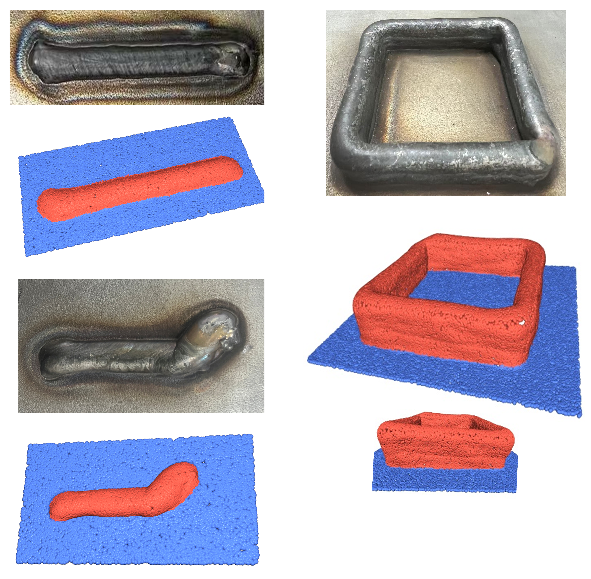
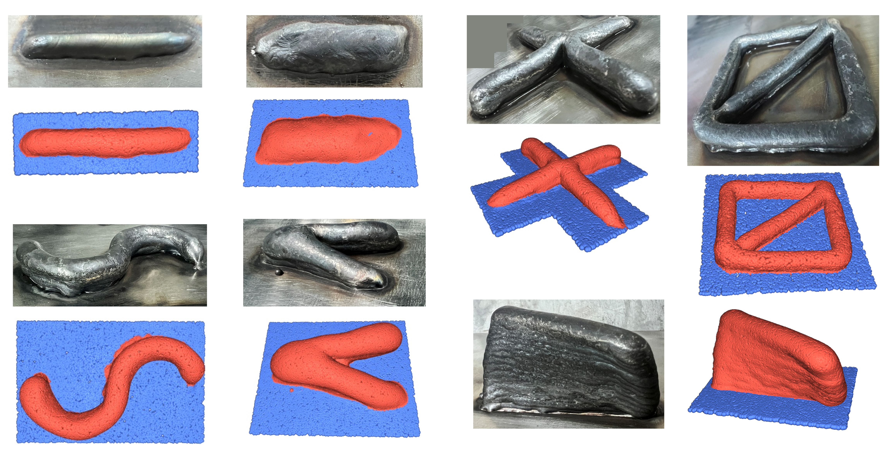
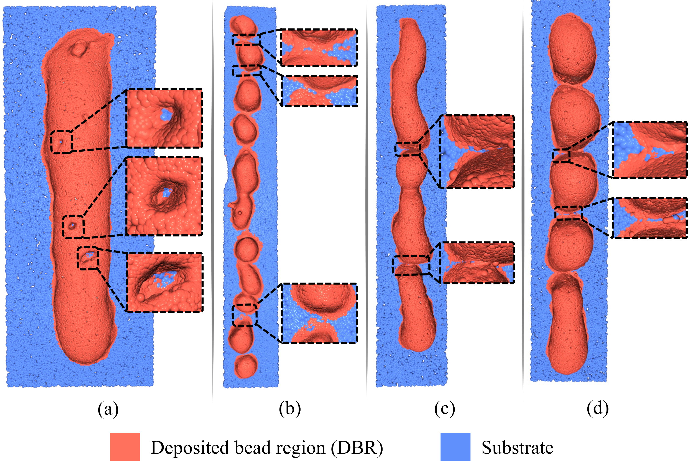
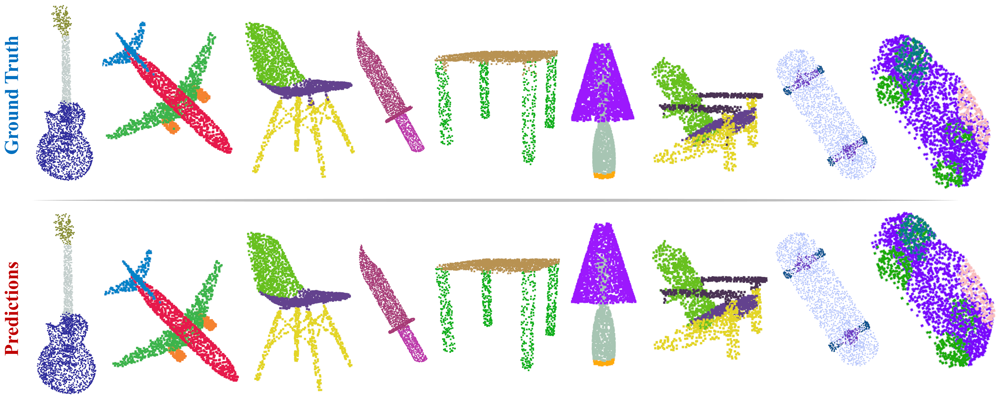

# BSCFNet Modules Demo

**BSCFNet** stands for **Boundary-Statistical Context Fusion Network**, a repair-oriented point cloud semantic segmentation network designed for deposited bead region (DBR) segmentation in teaching-free repair of arc-based directed energy deposition (DED-Arc).

This repository provides module-level demonstration code for three task-driven components of BSCFNet:

- **Boundary-Enhanced Hybrid Sampling (BEHS)**
- **Multi-branch Statistical Channel Attention (MSCA)**
- **Global Context Extractor (GCE)**

The released code is intended to demonstrate the core computational logic of these modules. It is not the complete implementation of the full BSCFNet training, inference, dataset preprocessing, or repair-validation pipeline.

---


## Visual Examples

The following figures show representative DBR segmentation and validation results. The deposited bead region (DBR) is shown in red, and the substrate is shown in blue.

### Results on DBRSet

<p align="center">
  
</p>

### Results in an Industrial Environment

<p align="center">
  
</p>

### Results on Non-uniform Deposition Morphologies

<p align="center">
  
</p>

### Results on ShapeNet Parts

<p align="center">
  
</p>


## Overview

Teaching-free repair of DED-Arc components requires reliable perception of the deposited bead region directly from scanned point clouds. However, accurate DBR-substrate boundary segmentation is challenging because the transition between the deposited bead and the substrate is often weak, blurred, and irregular.

BSCFNet addresses this challenge by introducing task-driven modules that improve boundary-sensitive sampling, local statistical feature enhancement, and global contextual representation. These modules are designed to support accurate DBR boundary segmentation and downstream repair-oriented geometric analysis, including boundary extraction, centerline fitting, repair-region localization, and compensatory path generation.

This repository currently focuses on the following three core modules:

1. **BEHS** improves sampling near boundary-sensitive regions.
2. **MSCA** enhances local statistical feature responses using multi-branch channel attention.
3. **GCE** extracts global contextual features using global average pooling.

---

## Important Note

This repository only provides **demonstration code** for the BEHS, MSCA, and GCE modules.

The complete BSCFNet implementation, including:

- full network architecture,
- training pipeline,
- inference scripts,
- dataset preprocessing workflow,
- DBRSet construction scripts,
- repair-region localization,
- compensatory path planning,
- and DED-Arc repair-validation pipeline,

is **not publicly released at this stage**.

The complete project is currently associated with an ongoing funding project that has not yet been declassified or publicly released. After the funding project is declassified and approved for public release, the related source code and additional implementation details will be updated in this repository.

---

## Released Content

At this stage, the repository includes independent demo implementations of the following modules:

| Module | File | Key configuration |
|---|---|---|
| BEHS | `modules/behs_demo.py` | KNN = 24, rho = 0.5 |
| MSCA | `modules/msca_demo.py` | Branch number = 4 |
| GCE | `modules/gce_demo.py` | GAP-based global feature extraction |

The demo scripts use synthetic inputs and can be executed independently to verify the input-output behavior of each module.

---

## Project Structure

```text
BSCFNet-modules-demo/
├── README.md
├── requirements.txt
├── modules/
│   ├── behs_demo.py
│   ├── msca_demo.py
│   └── gce_demo.py
├── full_code/
│   └── README.md
└── data/
    └── README.md
```

## Directory Description

### `modules/`

Contains the released module-level demo code for BEHS, MSCA, and GCE.

### `full_code/`

Reserved for the future release of the complete BSCFNet implementation after the related funding project is declassified and approved for public release.

### `data/`

Reserved for representative sample data or future public dataset release information.

---

## Requirements

The demo code is lightweight and can be executed independently on CPU for functional verification.

Recommended environment:

- Python >= 3.8
- PyTorch >= 2.0.0
- NumPy >= 1.24.0
- scikit-learn >= 1.2.0

Install dependencies using:

```bash
pip install -r requirements.txt
```

The recommended `requirements.txt` is:

```text
torch>=2.0.0
numpy>=1.24.0
scikit-learn>=1.2.0
```

The demo modules do not require the full BSCFNet training environment. CUDA is not required for running the demo scripts, although a CUDA-enabled PyTorch environment can also be used.

---

## Quick Start

Clone this repository:

```bash
git clone https://github.com/BalwynPang/BSCFNet-modules-demo.git
cd BSCFNet-modules-demo
```

Install dependencies:

```bash
pip install -r requirements.txt
```

Run the module demos:

```bash
python modules/behs_demo.py
python modules/msca_demo.py
python modules/gce_demo.py
```

Each script creates synthetic input tensors or point clouds and prints the output tensor shape to verify that the module works independently.

---

## Core Module Descriptions

## 1. Boundary-Enhanced Hybrid Sampling

**File:** `modules/behs_demo.py`

BEHS is designed to improve point cloud sampling by preserving boundary-sensitive points while maintaining the global point distribution.

In conventional random sampling, critical boundary points may be discarded, especially when DBR-substrate transitions are weak or irregular. BEHS addresses this issue by combining boundary-aware point selection with random sampling.

### Core Idea

For each point, BEHS estimates local normal variation using its K-nearest neighbors. Points with higher normal variation are more likely to be located near geometric transitions or boundary-sensitive regions. BEHS selects a proportion of such points and combines them with randomly sampled points.

### Key Settings

```text
KNN = 24
rho = 0.5
```

where:

- `KNN = 24` denotes the number of nearest neighbors used for normal estimation and normal variation calculation.
- `rho = 0.5` means that 50% of sampled points are selected based on boundary-sensitive scores, while the remaining 50% are randomly sampled.

### Input and Output

Typical input:

```text
xyz:      [B, N, 3]
features: [B, C, N, 1]
```

Typical output:

```text
sampled_features: [B, C, N', 1]
sampled_indices:  [B, N']
```

where:

- `B` is the batch size,
- `N` is the number of input points,
- `C` is the number of feature channels,
- `N'` is the number of sampled points.

### Run Demo

```bash
python modules/behs_demo.py
```

---

## 2. Multi-branch Statistical Channel Attention

**File:** `modules/msca_demo.py`

MSCA is designed to enhance local feature responses by capturing statistical variations in neighborhood features.

In DBR boundary regions, the local neighborhood may contain both deposited bead points and substrate points. This mixed composition causes statistical fluctuations in feature channels. MSCA uses such statistical cues to improve feature discrimination near weak boundaries.

### Core Idea

Given a neighborhood feature tensor, MSCA calculates statistical descriptors such as mean and standard deviation along the neighborhood dimension. These descriptors are passed through multiple lightweight excitation branches to generate channel attention weights.

### Key Settings

```text
Branch number = 4
```

The four-branch design allows the module to learn complementary feature reweighting patterns with different sensitivity levels.

### Input and Output

Typical input:

```text
x: [B, C, N, K]
```

where:

- `B` is the batch size,
- `C` is the number of feature channels,
- `N` is the number of points,
- `K` is the number of neighbors.

Typical output:

```text
x_out: [B, C, N, K]
```

### Run Demo

```bash
python modules/msca_demo.py
```

---

## 3. Global Context Extractor

**File:** `modules/gce_demo.py`

GCE is designed to extract global contextual information from point clouds. It provides global structural cues that complement local boundary-sensitive features.

Local feature aggregation alone may be insufficient when the DBR boundary is weak or ambiguous. GCE introduces global information to improve boundary discrimination across different geometric structures.

### Core Idea

GCE first maps each point coordinate into a latent feature space using a shared multilayer perceptron. Then, global average pooling is applied across all points to obtain a compact global descriptor.

### Key Setting

```text
Global pooling strategy = GAP
```

GAP denotes **global average pooling**.

### Input and Output

Typical input:

```text
xyz: [B, N, 3]
```

Typical output:

```text
global_feature: [B, D]
```

where:

- `B` is the batch size,
- `N` is the number of points,
- `D` is the global feature dimension.

### Run Demo

```bash
python modules/gce_demo.py
```

---

## Relationship with the Full BSCFNet

The released modules correspond to the task-driven components used in BSCFNet.

In the full BSCFNet pipeline:

- BEHS is used to enhance boundary-aware sampling.
- MSCA is used to improve local statistical feature responses.
- GCE is used to inject global contextual information into the segmentation network.

However, this repository does not include the complete encoder-decoder architecture, training loop, dataset loading pipeline, evaluation scripts, or repair-validation scripts.

The purpose of this repository is to provide a transparent module-level demonstration while protecting the unreleased components of the full funding project.

---

## Planned Updates

The following components are planned for future release after the related funding project is declassified and approved for public release:

- Full BSCFNet network architecture
- Training scripts
- Inference scripts
- Dataset preprocessing scripts
- DBRSet data loading pipeline
- Evaluation scripts
- Repair-region localization code
- Compensatory path planning code
- Additional sample point cloud data
- More detailed implementation documentation

---

## Data Availability

The complete dataset is not publicly available at this stage because it is associated with an ongoing funding project.

A representative subset of point cloud data and annotations may be released for demonstration and verification purposes. After the funding project is declassified and approved for public release, additional data will be updated in this repository or deposited in a recognized public data repository.

For journal submission, a representative dataset subset may be deposited separately in a public repository such as Zenodo or Figshare.

---

## Code Availability Statement

The demonstration code for the BEHS, MSCA, and GCE modules is openly available in this repository.

The complete BSCFNet training, inference, dataset preprocessing, and repair-validation pipeline is not publicly available at this stage because it is associated with an ongoing funding project. The full implementation will be updated after the project is declassified and approved for public release.

---

## Example Usage

A minimal example for running the GCE module:

```python
import torch
from modules.gce_demo import GlobalContextExtractor

B, N = 2, 1024
xyz = torch.randn(B, N, 3)

gce = GlobalContextExtractor(global_feature_dim=64)
global_feature = gce(xyz)

print(global_feature.shape)
```

Expected output:

```text
torch.Size([2, 64])
```

A minimal example for running the MSCA module:

```python
import torch
from modules.msca_demo import MultiBranchStatisticalChannelAttention

B, C, N, K = 2, 64, 1024, 24
x = torch.randn(B, C, N, K)

msca = MultiBranchStatisticalChannelAttention(channels=C, branches=4)
x_out = msca(x)

print(x_out.shape)
```

Expected output:

```text
torch.Size([2, 64, 1024, 24])
```

---

## Notes

- This repository is intended for academic demonstration and review purposes.
- The provided scripts are independent module demos and are not the full BSCFNet implementation.
- The demo code uses synthetic inputs for functional verification.
- The released code does not include the full DBRSet dataset.
- The released code does not include complete DED-Arc repair planning or robot execution scripts.
- Future updates will be made after the related funding project is approved for public release.

---

## Citation

If this repository or the related method is helpful for your research, please cite the corresponding paper once it is published.

```bibtex
@article{bscfnet2026,
  title={A Boundary-Statistical Context Fusion Network for Deposited Layer Segmentation toward Teaching-Free Repair in Arc-Based Directed Energy Deposition},
  author={Pang, Bowen and Zhao, Miao and Chen, Long and Wang, Liwei and Zhou, Naixun and Jia, Qingwei and Teshome, Fissha Biruke and Wang, Guotai and Peng, Bei and Zeng, Zhi},
  journal={Virtual and Physical Prototyping},
  year={2026}
}
```

---

## Contact

For questions about this demo repository, please contact the corresponding author of the related manuscript.

You may also open an issue in this repository for questions related to the released module-level demo code.

---

## License

No open-source license is provided at this stage.

The released files are provided for academic demonstration and review purposes only. Reuse, redistribution, or commercial use of the code should follow the authors' permission and the final license terms after the complete project is publicly released.
